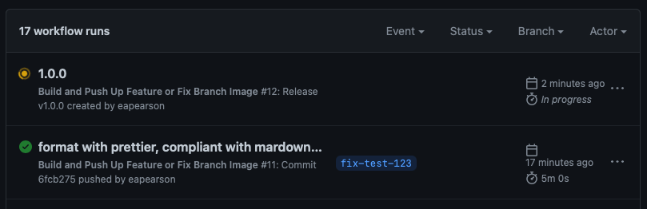
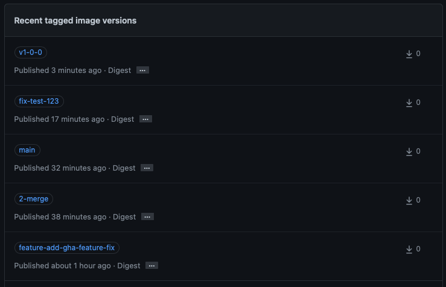

# Deployment

This document describes how to build and deploy a new version of this module in the KBase environment.

## Deploying this dashboard app in KBase

### 1. Set up a deployment image

This module uses Github Actions to build and save a Docker image at Github Container Repository (GHCR). This building gets triggered by releasing a new version through the releases page of the repo. Just draft a new release with a unique version, and that'll trigger the action.

You can monitor the action's progress through the _Actions_ tab.



Once the image is built, it's pushed to the `kbase/navigator` repo in GHCR. You can inspect the images built via Packages <https://github.com/kbase?tab=packages&repo_name=navigator>.

The image will have a tag which looks similar to the release tag, `v.#.#.#`, but has dashes substituted for periods, `v#-#-#`. In the example below, the version-tagged image is the top most one. Other images may be produced for merges into `main`, `fix-*`, `feature-*`, and pull request actions, which have a tag like `#-merge`, where `#` is the pull request number.

> These tag names are produced by using the `CI_REF_NAME_SLUG` environment variable created by the [`FranzDiebold/github-env-vars-action@v2`] action.



### 2. Deploy through Rancher

Developer deployment is available via [Rancher](https://rancher.com) for `CI` and `narrative-dev`. Neither access to Rancher nor production deployment is not described in this document.

In your environment of choice, open the Rancher view, and find the service named `navigator`:

Either way, upgrade (the little circled up-arrow on the right side) this to use the newly tagged image. Save and finalize the upgrade, and away it goes.

## Setting up a new stack

This takes a little extra work than the above.

1. Create a new stack in whatever Rancher environment. Name it `navigator`, as that is the recognized name for this service, and must match the `$servicehost` used in the `nginx` config stanza described below.
2. Set the following environment variables:

   - `URL_PREFIX` - this is the prefix for any path that the "service" (the server that comes along with this module) generates. I.e., it's the path that to the entrypoint. On narrative-dev, it's `/narratives`, so the URL of the main page is `https://narrative-dev.kbase.us/narratives`

   - `KBASE_ROOT` - this is the root URL for the environment. `https://ci.kbase.us`, `https://narrative-dev.kbase.us`, etc. This is used to craft most external link URLs.

   - `KBASE_ENDPOINT` - this is the root endpoint for all services. `https://kbase.us/services` for production, `https://ci.kbase.us/services` for CI, etc. This is used to call individual data providers.

3. Everything else should be default.
4. Update the environment nginx to route to the path you just created. It will need a block like this:

   ```nginx
   location ~ /(navigator)/(.*) {
       set $servicehost $1;
       set $serviceurl $2;
       proxy_pass http://$servicehost:5000/$serviceurl;
       proxy_set_header X-Forwarded-For $proxy_add_x_forwarded_for;
       proxy_set_header X-Real-IP $remote_addr;
       proxy_set_header Host $http_host;
       proxy_set_header X-Forwarded-Proto $scheme;
   }
   ```

   Note that `(navigator)` in the location line above implies that the service name is `navigator`. That hard-coded value is captured by the `()` group and made available via `set $servicehost $1;` as the host name for the service. The Rancher config is converted to a `docker-compose` configuration in which the Rancher service name becomes the docker-compose service name which in turn becomes the containers host name in the docker network.

   That needs to get checked in to the secure nginx config location and the nginx image restarted, so this requires help from people who can do that.

5. Once nginx restarts, and the new stack is available, the new route should be available as well. You can then easily redeploy any changes through Rancher as above.
