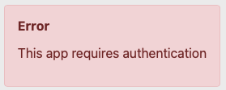
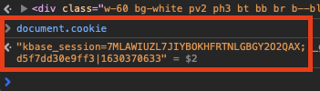
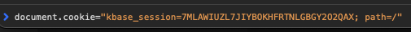

# Development

This is a brief document, noting some current development practices for the Navigator.

The Narratives Navigator, or Navigator for short, is composed of a small Python server, which serves as a configurable web server responsible for the initial html document, and a React Single Page App (SPA) written in Typescript. Although the codebase retains some remnants of what looks to be an early attempt to implement other components of the UI (similar to kbase-ui) like catalog, feeds, etc. it is currently essentially just a single-purpose Navigator SPA, hosted by a Python web server. (Similarly, kbase-ui is a SPA hosted by an nginx web server.)

## Working on the codebase

There are two main approaches to working on the codebase, both of which utilize a Docker Compose file to control both the Navigator web server an an nginx reverse proxy (to facilitate communication with KBase services).

1. The Navigator is contained in an image defined by the root `Dockerfile`
2. A root `docker-compose.yml` propagates or creates environment variables with sane defaults for development; environment variables are defined for the Navigator server and the nginx proxy.
3. The `docker-compose.yml` starts an nginx proxy, which allows development against localhost to use service calls against localhost, which are in turn proxied to the respective environment. (This obviates the need for CORS, which is often not set up correctly for KBase services.)
4. The Navigator container is started with the entire repo mounted from the host machine into the container; this means that changes made to files will be nearly immediately available inside the container.
5. A "watcher" process is started which re-compiles the web app when source changes are saved.
6. This enables the classic workflow:
   - edit source
   - save source
   - reload browser

## Environment Variables

Environment variables are used to parameterize a Navigator deployment, including local development.

- `KBASE_ROOT` specifies a url origin - the initial url protocol, host and port of a url - to be used to form links to KBase user interfaces. This variable is stored in the configuration as `host_root`. Any urls formed to KBase user interfaces should use the `host_root` config key. In development it defaults to `https://ci.kbase.us`

  For example, if `KBASE_ROOT` is set to `https://ci.kbase.us`, the following snippet could be used to create a link to kbase-ui's About page:

  ```typescript
  const { host_root } = Runtime.getConfig();
  const url = `${host_root}#about`;
  const link = <a href={url}>About kbase-ui</a>;
  ```

- `KBASE_ENDPOINT` specifies a base url to use for forming KBase service endpoint urls. It differs from `KBASE_ROOT` in that it is not strictly an "origin" because it almost always includes the path `/services`.

  In `localhost` based development (described below), the endpoint is set to `http://localhost:5011/services`, but in KBase deployments is `http://[ENV.]kbase.us/services`, where `ENV` is either ci, next, narrative-dev and in production is omitted.

  For example, the `KBASE_ENDPOINT` for CI is `https://ci.kbase.us/services`, for production is `https://kbase.us/services`.

  `KBASE_ENDPOINT` is propagated into the `service_root` config key, but is not actually directly used in the codebase. Rather, it is incorporated into the service route keys like `service_routes.SERVICE_NAME`, where `SERVICE_NAME` is a service identifier like `workspace`, `user_profile`. See `src/static/config.json` for available service identifiers.

  ```typescript
  const workspaceClient = new KBaseServiceClient({
    module: 'Workspace',
    url: Runtime.getConfig().service_routes.workspace,
    authToken: this.props.authInfo.token,
  });
  ```

- `URL_PREFIX` specifies the initial component(s) of the path on which the Navigator will be accessed. It is used to form internal urls within the Navigator, and, other than when running in development on `localhost`, is almost always set to `narratives`.

  In `localhost` based development, the url prefix is empty, and otherwise should be set to `narratives`.

  For example, in a KBase CI deployment, `URL_PREFIX` will be set to `narratives`, and the canonical url to the Navigator would be `https://ci.kbase.us/narratives`. In local deployment on `localhost`, the `URL_PREFIX` would be omitted and default to the empty string, so the canonical url would be `http://localhost:5000`.

## Developing against `localhost`

The original development workflow runs the Navigator on `localhost`. In this workflow, the web app is available at `http://localhost:5000` and the service proxy on `http://localhost:5011`. The Navigator is configured to talk to KBase services via the proxy on `http://localhost:5011`, and the proxy in turn communicates with CI services at `https://ci.kbase.us/services`.

### Requirements

The full set of requirements for working on the codebase includes:

- git
- make
- docker
- nodejs 16
- yarn
- python 3.7

However, if you are working on the front end only, you will not need Python.

### Instructions

1. Clone the repo and enter its directory

   ```bash
   git clone https://github.com/kbase/navigator
   cd navigator
   ```

2. In one terminal start the Navigator server and proxy:

   ```bash
   make serve
   ```

   No environment variables are necessary as the default values fit this workflow.

3. In another terminal start the source code watcher:

   ```bash
   yarn install
   yarn watch
   ```

4. Take your browser to `http://localhost:5000`

5. You should see an error message:

   

6. You'll need to add a KBase token to the browser.

   - In another browser window, visit `https://ci.kbase.us`.
   - Ensure you are logged in with the same account you want to use with the Navigator
   - In the Javascript console, enter `document.cookie`.
   - Within the cookie displayed in the terminal, find `kbase_session=TTTT;` where `TTTT` is some token.

     

   - Copy the token value to the clipboard
   - Back in the Navigator browser window, add this token to the Navigator session:

     - Either use a cookie editing tool, or
     - Open the JS console and enter:
       `document.cookie='kbase_session=TTTT; path=/`

       

7. Reload the Navigator browser window - you should be logged in and have an operating Navigator!

### KBase deployment environments

Although development should typically run against CI services and interfaces, there are times when one needs to operate against production or another KBase deployment environment.

The `localhost` workflow does not directly support running against an environment other than CI. This is due to the fact that the development proxy upstream endpoint is not configurable.

> It would not be much work to add configuration for the proxy's nginx configuration - e.g. using dockerize.

Please see the section below for a workflow which supports working against any KBase deployment environment.

### Notes

Although the `localhost` development workflow has the benefit of simplicity, it does have limitations:

- the developer must manually set the auth cookie in the browser
- the Navigator cannot be easily used with existing kbase-ui or Narrative interfaces (links from Navigator work, but links to Navigator do not.)
- the development proxy is not parameterized to work with non-CI environments

The next section describes a similar workflow which removes these limitations.

## Developing against any KBase deployment environment and tighter UI integration

In this workflow, the Navigator will run on an actual deployment origin, by default `https://ci.kbase.us`.

> It is important to note that the Navigator internal server is oblivious to this; it will always be configured to run internally on all interfaces on port 5000.

In this workflow, the Navigator is accessed through the `kbase-ui` proxy, which handles requests to the Navigator on `https://ci.kbase.us/narratives` (by default). The kbase-ui proxy also acts as a front end for all service calls (on `https://ci.kbase.us/services`), kbase-ui itself.

Compared to the Navigator's development proxy, the kbase-ui proxy carries some advantages:

- it can be run with a development certificate, so that browser requests to `https` do not generate a certificate error message
- the kbase-ui proxy can also route to a local instance of the narrative or kbase-ui plugins
- the kbase-ui proxy can be configured on the fly to run against any supported KBase deployment environment.

This workflow enabled by these additional steps:

- temporarily mapping a KBase deployment hostname to localhost (via `/etc/hosts`)
- starting a copy of `kbase-ui` with `local-navigator=t`
- set environment variables to play nice with this workflow

```bash
URL_PREFIX=narratives KBASE_ROOT=https://ci.kbase.us KBASE_ENDPOINT=https://ci.kbase.us/services make serve
```

In order to use this you'll need to have kbase-ui up and running too. Instructions may be [found here](https://eapearson.gitbook.io/kbase-ui/workflows/alongside-navigator).

Below is a reproducible set of instructions for macOS. It assumes that `make` and `docker` are available, and

1. clone Navigator

   ```bash
   git clone https://github.com/kbase/navigator
   ```

2. Start the navigator against CI:

   ```bash
   cd navigator
   URL_PREFIX=narratives KBASE_ROOT=https://ci.kbase.us KBASE_ENDPOINT=https://ci.kbase.us/services make serve
   ```

   Note that we have now specified all of the environment variables used to control deployment - `URL_PREFIX`, `KBASE_ROOT`, and `KBASE_ENDPOINT`.

3. Clone kbase-ui

   ```bash
   git clone https://github.com/kbase/kbase-ui
   ```

4. Optional - use mkcert:

   1. Install mkcert on your host.

      E.g. on macOS using the MacPorts package manager:

      ```bash
      sudo port install mkcert
      ```

   2. Install mkcert with kbase-ui:

      ```bash
      make dev-cert
      ```

5. Alias CI to localhost:

   ```bash
   sudo vi /etc/hosts
   ```

   Add the line:

   ```text
   127.0.0.1 ci.kbase.us
   ```

6. Start kbase-ui:

   ```bash
   make start local-navigator=t
   ```

Now you may take your browser to `https://ci.kbase.us` and use Navigator and kbase-ui just as if it were deployed at KBase. For instance, you may login and use the Navigator easily with any account you have access to, without manually setting cookies.

Just as for the localhost workflow, you may open a terminal in the Navigator repo directory and run `yarn watch` to ensure that changes you make to the web app code are reflected in the running Navigator, enabling the "edit, save, reload" workflow.

### Running against arbitrary environments

Orchestrating the Navigator to run against other deployment environments is simply a matter of changing the `KBASE_ROOT` and `KBASE_ENDPOINT` environment variables For example, to run against `next`:

```bash
URL_PREFIX=narratives KBASE_ROOT=https://next.kbase.us KBASE_ENDPOINT=https://next.kbase.us/services docker-compose up
```

Of course, _**production is special**_. The ui and services operate on different host names:

```bash
URL_PREFIX=narratives KBASE_ROOT=https://narrative.kbase.us KBASE_ENDPOINT=https://kbase.us/services docker-compose up
```
